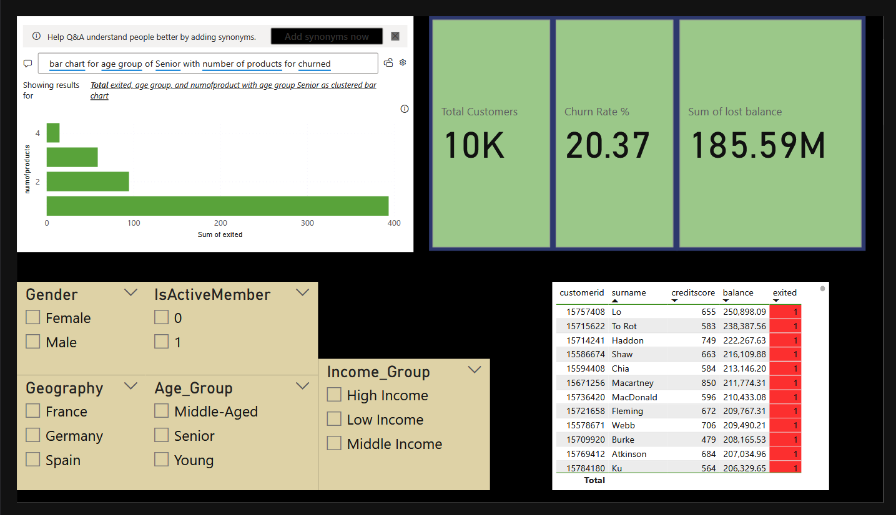

# Bank Customer Churn & Retention Analysis
Objective: Identifying high-risk customer segments and providing actionable retention strategies for a retail banking dataset using SQL, Python, and Power BI.

# 📌 Executive Summary
This project analyzes a dataset of 10,000 banking customers to understand the drivers behind customer churn (attrition). By combining SQL for data engineering, Python for statistical deep-dives, and Power BI for executive reporting, I identified a critical "Risk Zone" among Senior customers in specific geographic regions.

# 🛠️ Tech Stack
  - SQL (PostgreSQL): Data cleaning, segmentation, and aggregate analysis.
  - Python (Pandas, Seaborn, Matplotlib): Statistical correlation and distribution analysis.
  - Power BI: Interactive dashboarding and risk-table development.

# 🔍 Key Insights & Findings
  1. The "Senior" Risk Zone (SQL Finding)
    Observation: While the overall churn rate is ~20%, customers aged 50+ (Seniors) show a significantly higher churn rate of 44.65%.
    Business Impact: Despite being a smaller segment (1,261 customers), they represent a disproportionately high risk to the bank's total deposit base.

  2. The "Activity" Rescue Effect (Python Finding)
    Observation: While Seniors (>50) already have a high churn rate, Inactive Seniors reached a staggering 84.94% churn rate.
    Insight: Activity status is the single most important predictor of retention for the bank's most vulnerable demographic.

  3. The Financial Loss (Power BI Finding)
    Observation: Total churned members led to $185.59M in lost balance.
    Strategic Insight: Consulting high-balance churned members' reason to leave may provide additional solutions to tackle this issue.

# 📈 The Dashboard (Power BI)

The interactive dashboard includes:
  - KPI Overview: Real-time tracking of Churn Rate and At-Risk Capital.
  - Demographic Slicers: Ability to filter by Country, Gender, and Activity status.
  - Risk Table: A prioritized list of high-balance, high-risk customers for immediate marketing intervention.

# 💡 Business Recommendations
Based on the data, I recommend the following three-pronged strategy:
  - Senior Engagement Campaign: Launch a digital literacy program or simplified app interface for customers aged 45+ to increase "Active Member" status.
  - Product Bundle Review: Re-evaluate the value proposition for customers with 3+ products to identify why these bundles are failing to retain users.
  - Regional Retention Incentives: Implement targeted loyalty offers in the Germany region to combat localized churn spikes.
